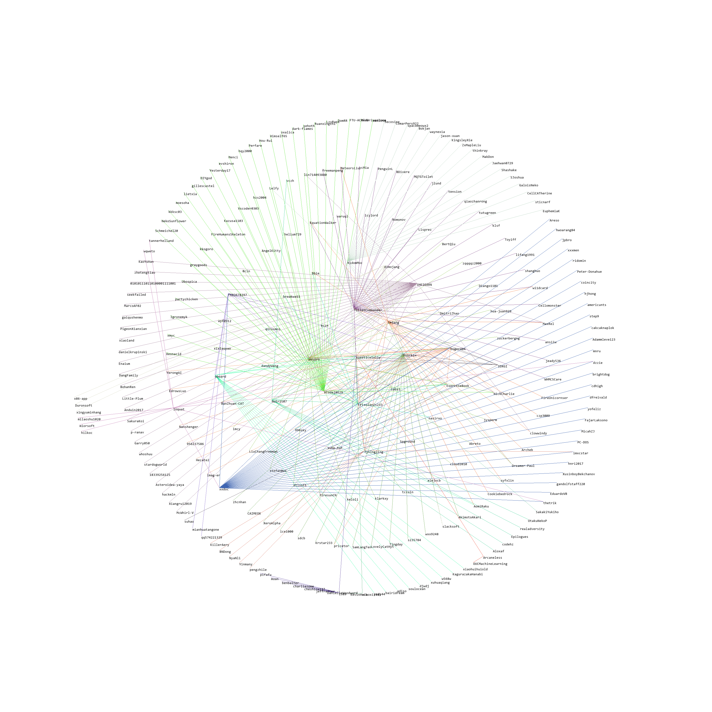

# Github Friends
Show the friends of your friends!

Enjoy a diagram that illustrates the relationships!

And discover the person you may know!

# How to Use

1. Install python
2. Install dependencies via pip: `pip install numpy pillow requests`
3. `python main.py`
4. Select mode

**Mode 1**

This mode loads relationship database from database.npy and draws a diagram of the relationships.

**Mode 2**

This mode generates the relationship database of a specified user by retrieving followers / followings relationships from Github.

# Demo

Here is a diagram of my Github friends (depth = 1)

Open it in a new tab to zoom in!

